# ========================================
# Air Vehicle Low-Cost Hybrid Configurable Jet Engine Configuration for 0kft to 100kft Altitude UAV Operation:
# ========================================

## I. Design Context Overview:

## 
## 
## II. Overview of Hybrid Configurable Jet Engine Configuration:

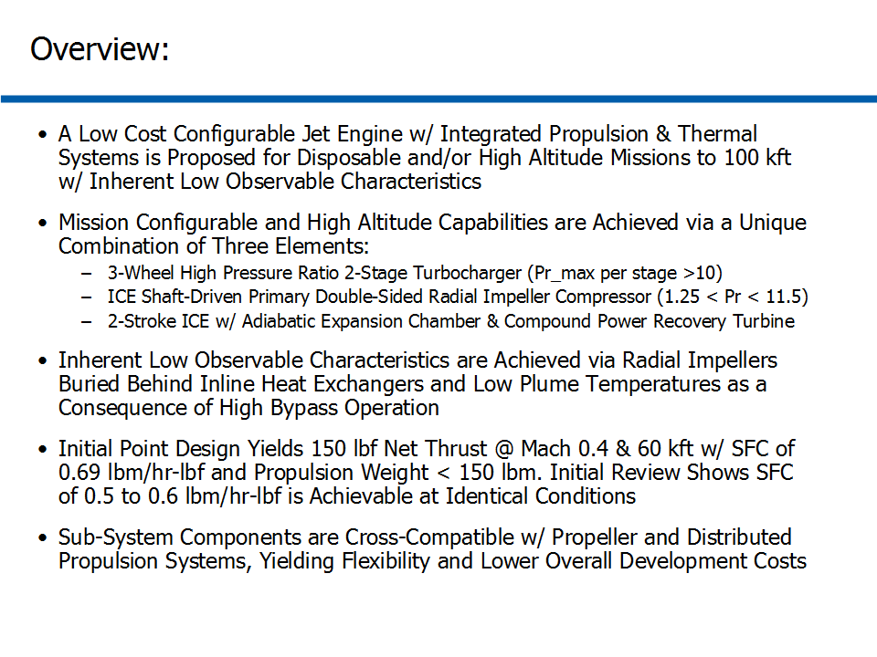

## 
## 
## III. 60Kft Altitude Net Thrust & SFC Performance:

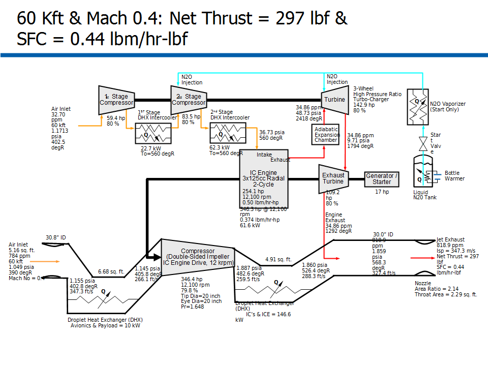

## 
## 
## IV. 70Kft Altitude Net Thrust & SFC Performance:

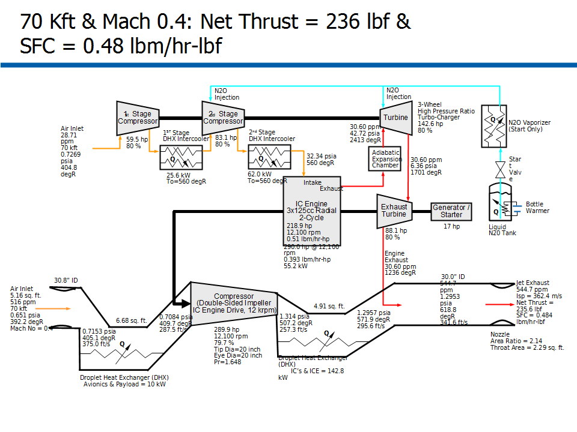

## 
## 
## V. 80Kft Altitude Net Thrust & SFC Performance:

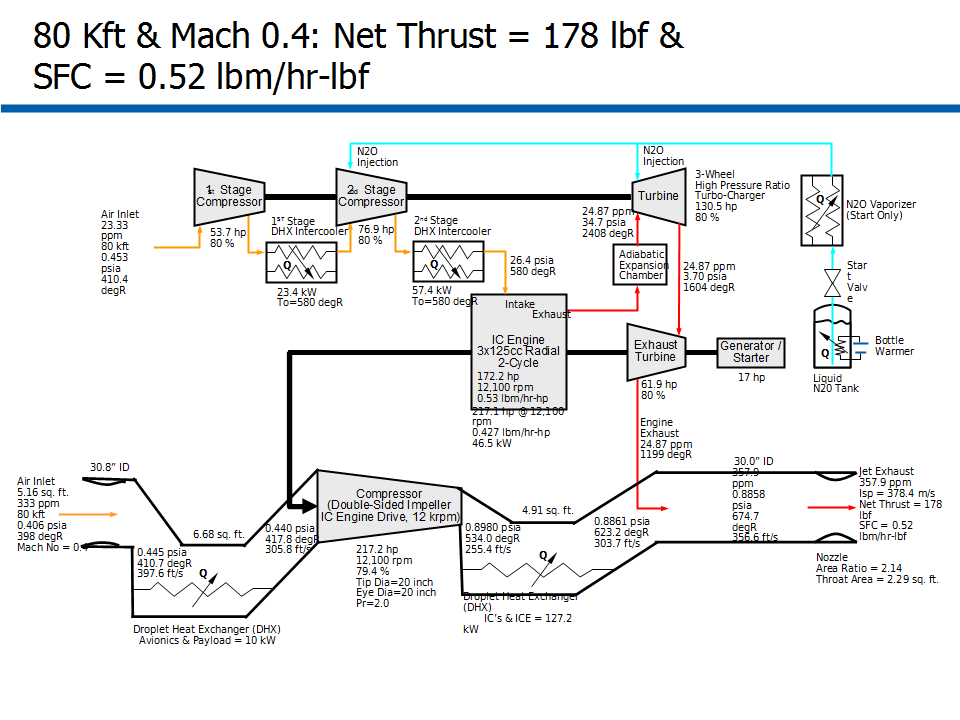

## 
## 
## VI. 90Kft Altitude Net Thrust & SFC Performance:

## 
## 
## VII. 100Kft Altitude Net Thrust & SFC Performance:

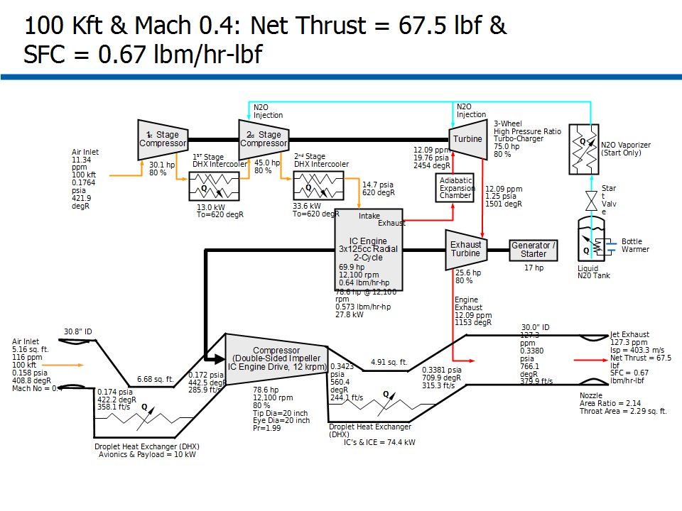

## 
## 
## VIII. Overview of Propulsion System Schematic:

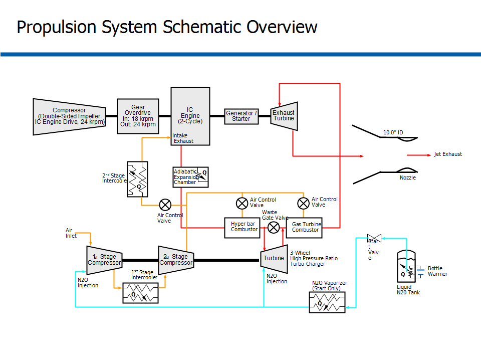

## 
## 
## IX. Double-Sided Shaft-Driven Compressor Features & Dimensions:

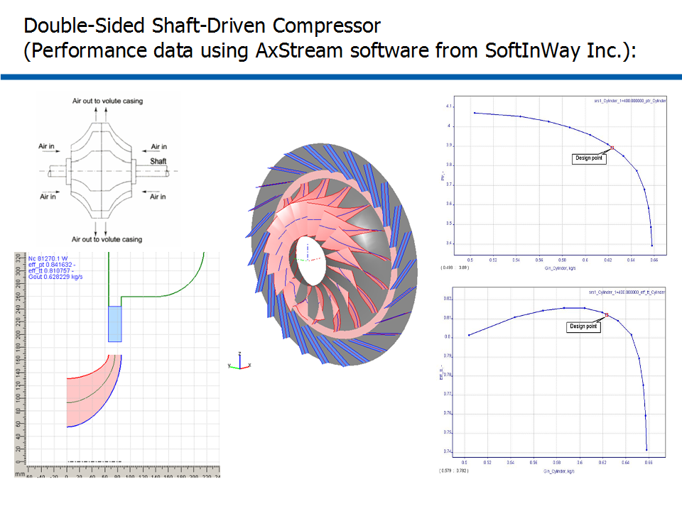

## 
## 
## X. 1st Stage Double-Sided Compressor Features & Dimensions:

## 
## 
## XI. 2nd Stage Single-Sided Compressor Features & Dimensions:

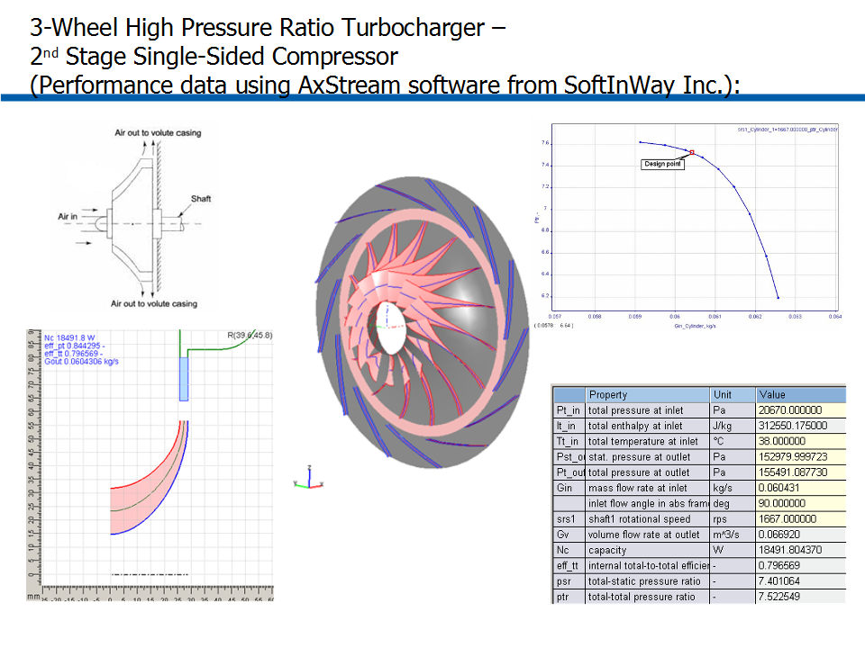

## 
## 
## XII. Turbine Features & Dimensions:

## 
## 
## XIII. Overview of Hybrid Configurable Jet Engine System:

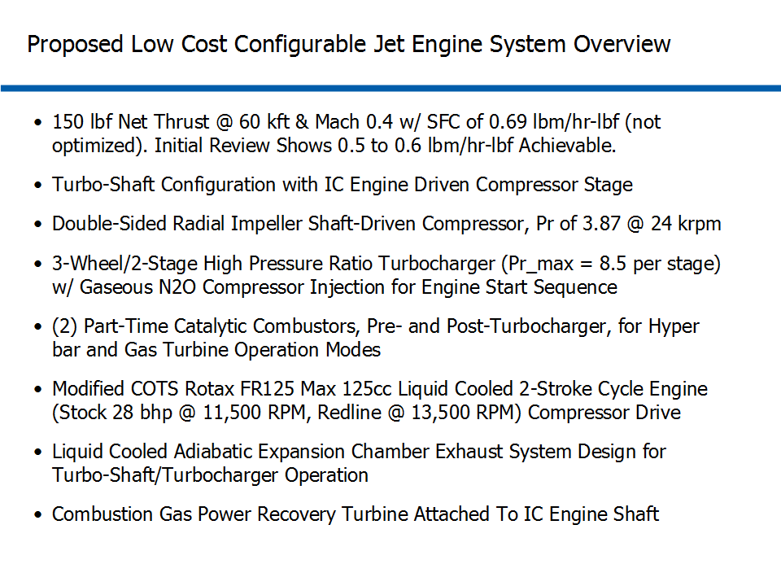

## 
## 
## XIV. Overview of Payload/Avionic Thermal System Schematic:

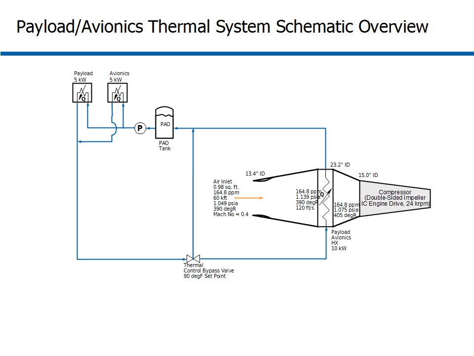

## 
## 
## XV. Overview of Direct-Contact Heat Exchanger:

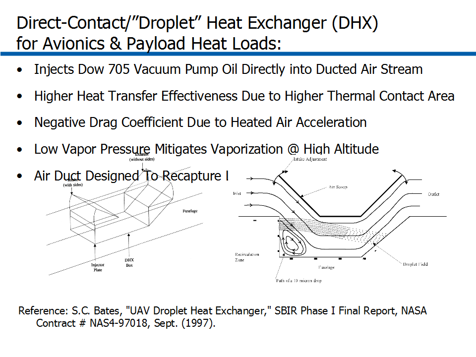

## 
## 
## XVI. Overview of DHX System Schematic:

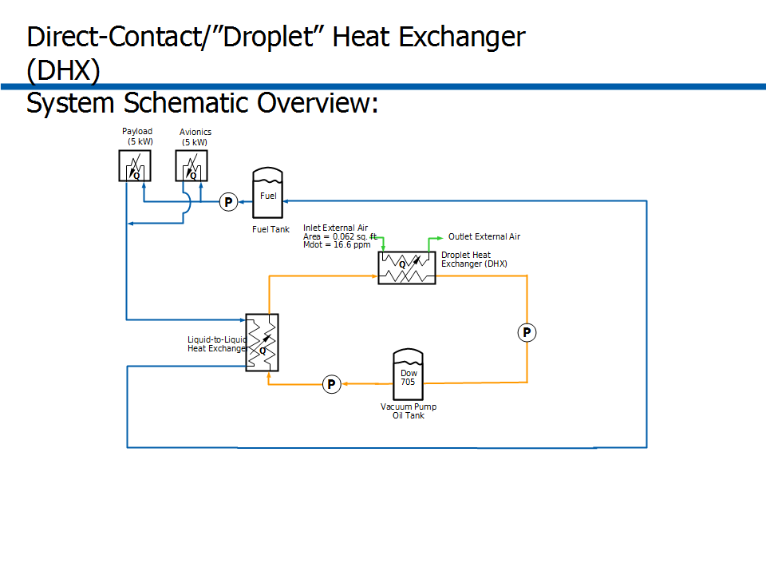

## 
## 
## XVII. Overview of Propulsion/Thermal Schematic:

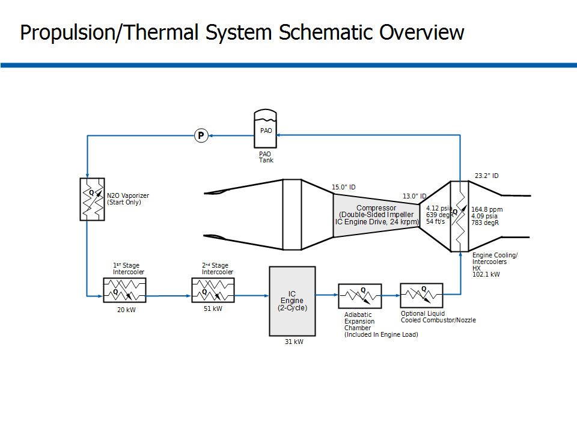

## 
## 
## XVIII. Overview of ICE Sub-System Performance Analysis:

## 
## 
## XIX. Summary of Modified COTS ICE Sub-System:

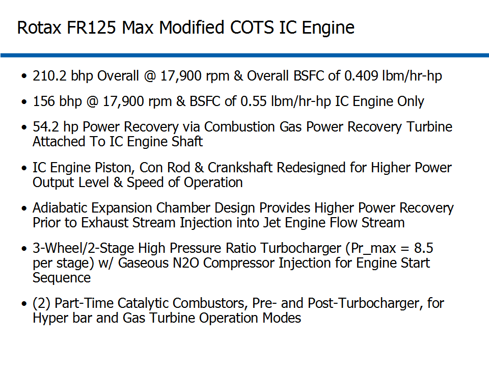

## 
## 
## XX. Modified COTS IC Engine:

## 
## 
## XXI. Adiabatic/Choked 3-Stage Expansion Chamber Design:

## 
## *Notes: 
## 1. Turbomachinery Performance Data and Analysis performed using AxStream, SoftInWay Inc.
## 2. ICE Performance Data and Analysis performed using "GT-Suite", Gamma Technologies Inc.
